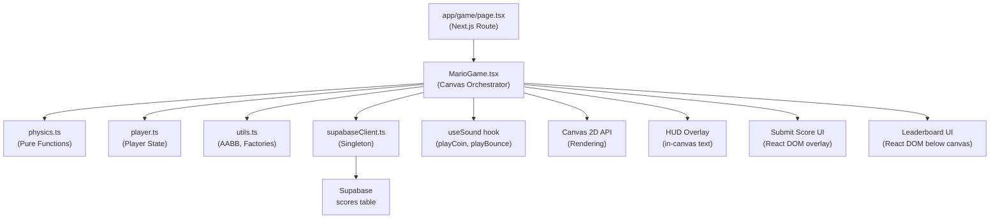
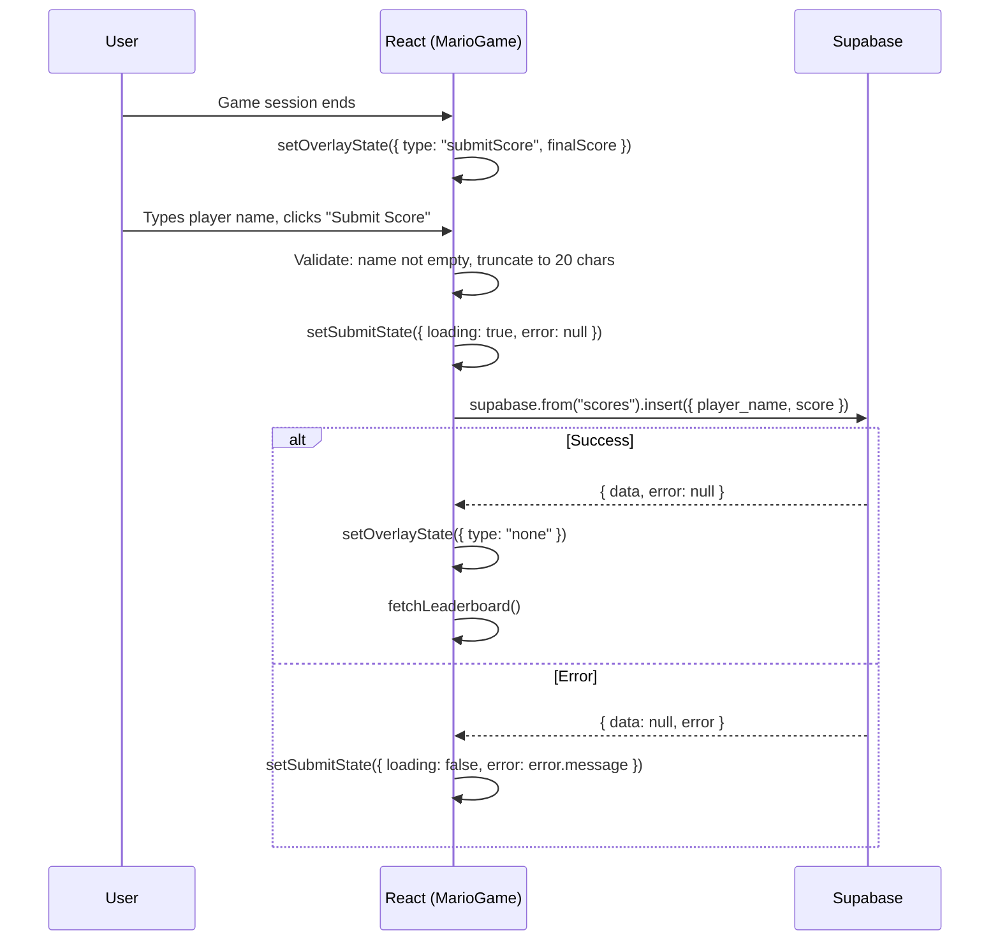

# Design Document — mario-game-supabase

## Overview

This feature adds a playable Super Mario-style mini-game to the Next.js pixel-art portfolio. The game renders on an HTML5 Canvas inside a dedicated `/game` route and integrates with Supabase to persist player scores and display a live leaderboard.

The implementation is split into four layers:

1. **Pure game logic** — `app/lib/game/physics.ts`, `app/lib/game/player.ts`, `app/lib/game/utils.ts`
2. **Canvas orchestration** — `app/components/game/MarioGame.tsx`
3. **Route page** — `app/game/page.tsx`
4. **Backend integration** — `app/lib/supabaseClient.ts` + Supabase `scores` table

All visual tokens are sourced from the existing `dayTheme`, `pixelGrid`, and `zIndex` exports in `app/lib/theme.ts`. The Press Start 2P font is already loaded globally via `app/styles/globals.css`. The `image-rendering: pixelated` rule is already applied globally to `canvas` elements via `app/styles/pixel.css`.

---

## Architecture



### Key Architectural Decisions

**Refs vs React state in the game loop.** The game loop runs inside `requestAnimationFrame` and must never call `setState` — doing so would trigger React re-renders mid-frame and cause visual tearing. All mutable game state (player position, entity lists, score, lives) is stored in a single `useRef<GameState>` object. React state (`useState`) is used only for UI overlays that live outside the canvas: the submit-score form, leaderboard data, loading flags, and error messages.

**Pure module separation.** `physics.ts`, `player.ts`, and `utils.ts` export only pure functions with no React imports. This makes them independently testable with Vitest without any DOM or React setup.

**Single game-state ref.** Rather than multiple refs for each entity list, a single `gameStateRef: React.MutableRefObject<GameState>` holds the entire mutable world. This simplifies the game loop — one read, one write per tick.

---

## Components and Interfaces

### `app/game/page.tsx`

A standard Next.js App Router page component. Imports `MarioGame` via `next/dynamic` with `{ ssr: false }`. Renders the section title and the dynamic component inside a centered layout container.

```tsx
// Skeleton
import dynamic from "next/dynamic";
const MarioGame = dynamic(() => import("@/components/game/MarioGame"), { ssr: false });

export default function GamePage() {
  return (
    <main>
      <h1 className="pixel-text" style={{ color: dayTheme.colors.coin }}>
        PLAY MY MARIO GAME
      </h1>
      <MarioGame />
    </main>
  );
}
```

### `app/components/game/MarioGame.tsx`

Top-level `"use client"` component. Owns:
- A `<canvas>` ref for rendering
- A `gameStateRef` holding the full `GameState`
- A `rafRef` for the active `requestAnimationFrame` handle
- React state for UI overlays: `overlayState`, `leaderboard`, `submitState`
- The `useSound` hook for audio callbacks
- A `ResizeObserver` for responsive canvas sizing

Lifecycle:
1. `useEffect` on mount: initialise game state, attach keyboard listeners, start game loop, attach resize observer.
2. `useEffect` cleanup: cancel RAF, remove keyboard listeners, disconnect resize observer.
3. Game loop function: compute capped delta-time → update physics → update entities → render → schedule next frame.

### `app/lib/game/physics.ts`

Exports pure functions only. No imports from React or Next.js.

```ts
export function applyGravity(vy: number, dt: number, gravity: number): number
export function capDeltaTime(rawDt: number): number
export function resolveAABBCollision(player: Rect, platform: Rect): CollisionResult
export function clampX(x: number, width: number, canvasWidth: number): number
```

### `app/lib/game/player.ts`

Exports the `PlayerState` type and pure update functions.

```ts
export interface PlayerState {
  x: number; y: number;
  vx: number; vy: number;
  width: number; height: number;
  isGrounded: boolean;
  facingRight: boolean;
  animFrame: number;
  animTimer: number;
}

export function createPlayer(canvasWidth: number, canvasHeight: number): PlayerState
export function applyHorizontalInput(player: PlayerState, direction: -1 | 0 | 1, dt: number): PlayerState
export function applyJump(player: PlayerState): PlayerState
export function updatePlayerAnimation(player: PlayerState, dt: number): PlayerState
```

### `app/lib/game/utils.ts`

```ts
export interface Rect { x: number; y: number; width: number; height: number; }

export function aabb(a: Rect, b: Rect): boolean
export function createPlatform(x: number, y: number, w: number, h: number): Platform
export function createCoin(x: number, y: number): Coin
export function createEnemy(x: number, y: number, speed: number): Enemy
export function layoutLevel(canvasWidth: number, canvasHeight: number): LevelLayout
```

### `app/lib/supabaseClient.ts`

```ts
import { createClient, type SupabaseClient } from "@supabase/supabase-js";

const url = process.env.NEXT_PUBLIC_SUPABASE_URL;
const key = process.env.NEXT_PUBLIC_SUPABASE_ANON_KEY;
if (!url) throw new Error("Missing env: NEXT_PUBLIC_SUPABASE_URL");
if (!key) throw new Error("Missing env: NEXT_PUBLIC_SUPABASE_ANON_KEY");

export const supabase: SupabaseClient = createClient(url, key);
```

---

## Data Models

### `Rect`

Base bounding-box type used by AABB collision and all entity types.

```ts
interface Rect {
  x: number;       // left edge in canvas pixels
  y: number;       // top edge in canvas pixels
  width: number;
  height: number;
}
```

### `PlayerState`

```ts
interface PlayerState extends Rect {
  vx: number;          // horizontal velocity px/s
  vy: number;          // vertical velocity px/s (positive = downward)
  isGrounded: boolean; // true when standing on a platform
  facingRight: boolean;
  animFrame: number;   // 0 or 1 for walk cycle
  animTimer: number;   // seconds since last frame switch
}
```

### `Platform`

```ts
interface Platform extends Rect {
  id: string;
  isGround: boolean;   // true for the full-width ground platform
}
```

### `Coin`

```ts
interface Coin extends Rect {
  id: string;
  collected: boolean;
  animTimer: number;   // for spin animation
}
```

### `Enemy`

```ts
interface Enemy extends Rect {
  id: string;
  vx: number;          // horizontal velocity (sign = direction)
  alive: boolean;
}
```

### `GameState`

The single mutable object stored in `gameStateRef`.

```ts
interface GameState {
  status: "idle" | "running" | "paused" | "dead" | "levelComplete" | "gameOver";
  player: PlayerState;
  platforms: Platform[];
  coins: Coin[];
  enemies: Enemy[];
  score: number;
  lives: number;
  canvasWidth: number;
  canvasHeight: number;
  lastTimestamp: number | null;
  inputState: InputState;
}
```

### `InputState`

Tracks which keys/buttons are currently held. Updated by keyboard and touch event handlers outside the game loop.

```ts
interface InputState {
  left: boolean;
  right: boolean;
  jump: boolean;   // edge-triggered: set true on keydown, consumed by player update
}
```

### `ScoreRow` (Supabase)

```ts
interface ScoreRow {
  id: string;           // uuid, PK
  player_name: string;  // max 20 chars
  score: number;        // integer
  created_at: string;   // ISO timestamp
}
```

### `OverlayState` (React state)

```ts
type OverlayState =
  | { type: "none" }
  | { type: "submitScore"; finalScore: number }
  | { type: "gameOver"; finalScore: number };
```

### `SubmitState` (React state)

```ts
interface SubmitState {
  playerName: string;
  loading: boolean;
  error: string | null;
  submitted: boolean;
}
```

### `LevelLayout`

Returned by `layoutLevel()` to initialise a fresh game world.

```ts
interface LevelLayout {
  platforms: Platform[];
  coins: Coin[];
  enemies: Enemy[];
  playerStart: { x: number; y: number };
}
```

---

## Physics Engine Design

### Constants

```ts
const GRAVITY = 1200;          // px/s²
const JUMP_VELOCITY = -480;    // px/s (negative = upward)
const MOVE_SPEED = 160;        // px/s
const ENEMY_SPEED = 80;        // px/s
const MAX_DELTA_TIME = 0.05;   // seconds
```

### Delta-Time Cap

```ts
export function capDeltaTime(rawDt: number): number {
  return Math.min(rawDt, MAX_DELTA_TIME);
}
```

Prevents large position jumps when the tab loses focus and `requestAnimationFrame` resumes after a long pause.

### Gravity Application

```ts
export function applyGravity(vy: number, dt: number): number {
  return vy + GRAVITY * dt;
}
```

Called every frame for any entity that is not grounded.

### AABB Collision Detection

```ts
export function aabb(a: Rect, b: Rect): boolean {
  return (
    a.x < b.x + b.width &&
    a.x + a.width > b.x &&
    a.y < b.y + b.height &&
    a.y + a.height > b.y
  );
}
```

Returns `true` if the two rectangles overlap (exclusive of touching edges).

### Collision Resolution

`resolveAABBCollision` computes the minimum translation vector (MTV) to separate the player from a platform. It returns a `CollisionResult` describing which face was hit and the corrected player position and velocity.

```ts
interface CollisionResult {
  resolved: boolean;
  face: "top" | "bottom" | "left" | "right" | null;
  player: PlayerState;
}

export function resolveAABBCollision(
  player: PlayerState,
  platform: Platform
): CollisionResult
```

Resolution logic:
1. Compute overlap on each axis.
2. Choose the axis with the smallest overlap (minimum penetration depth).
3. Push the player out along that axis and zero the corresponding velocity component.
4. Set `isGrounded = true` when the `top` face is resolved.

### Game Loop Tick

```
function tick(timestamp: number): void {
  const gs = gameStateRef.current;
  const rawDt = gs.lastTimestamp ? (timestamp - gs.lastTimestamp) / 1000 : 0;
  const dt = capDeltaTime(rawDt);
  gs.lastTimestamp = timestamp;

  // 1. Process input → update player velocity
  // 2. Apply gravity to player (if not grounded)
  // 3. Integrate player position: x += vx * dt, y += vy * dt
  // 4. Resolve player vs platform collisions
  // 5. Clamp player x to canvas bounds
  // 6. Check player vs coin collisions → collect
  // 7. Check player vs enemy collisions → defeat or die
  // 8. Update enemy positions and direction reversals
  // 9. Check fall-off (player.y > canvasHeight) → die
  // 10. Check level complete (coins.length === 0)
  // 11. Render frame
  // 12. Schedule next frame: rafRef.current = requestAnimationFrame(tick)
}
```

---

## Canvas Rendering Approach

### High-DPI Scaling

```ts
const dpr = window.devicePixelRatio ?? 1;
canvas.width = logicalWidth * dpr;
canvas.height = logicalHeight * dpr;
canvas.style.width = `${logicalWidth}px`;
canvas.style.height = `${logicalHeight}px`;
ctx.scale(dpr, dpr);
```

All game coordinates use logical pixels. The backing store is scaled by `dpr` for sharp rendering on Retina/HiDPI screens.

### Render Order (painter's algorithm)

1. Clear canvas (`ctx.clearRect`)
2. Fill sky background (`dayTheme.colors.sky`)
3. Draw platforms (`dayTheme.colors.ground` for ground, `dayTheme.colors.brick` for floating)
4. Draw coins (`dayTheme.colors.coin`) — simple spinning square animation
5. Draw enemies (`dayTheme.colors.pipe`) — rectangle with simple face pixels
6. Draw player (`dayTheme.colors.mario`) — rectangle with pixel-art face
7. Draw HUD overlay (score, lives) using Press Start 2P font via `ctx.font`

### Font Setup

```ts
ctx.font = '10px "Press Start 2P"';
ctx.fillStyle = "#ffffff";
ctx.fillText(`SCORE ${String(score).padStart(6, "0")}`, 8, 20);
```

The font is already loaded globally so it is available to the Canvas 2D context.

### `imageRendering: pixelated`

Already applied globally to all `canvas` elements via `app/styles/pixel.css`. No additional inline style needed on the canvas element itself (though the requirement also specifies it as an inline style for explicitness — both will be set).

---

## Responsive Container and 16:9 Aspect Ratio

```tsx
// Container div — constrains width, enforces 16:9 via padding-bottom trick
<div style={{
  width: "100%",
  maxWidth: "800px",
  margin: "0 auto",
  padding: `${pixelGrid.px4} ${pixelGrid.px4}`,
}}>
  <div style={{
    position: "relative",
    width: "100%",
    paddingBottom: "56.25%",  // 9/16 = 56.25%
  }}>
    <canvas
      ref={canvasRef}
      style={{
        position: "absolute",
        top: 0, left: 0,
        width: "100%",
        height: "100%",
        imageRendering: "pixelated",
      }}
      aria-label="Mario mini-game canvas"
    />
  </div>
</div>
```

A `ResizeObserver` on the container div fires whenever the container width changes. The handler reads `container.clientWidth`, computes `height = width * (9/16)`, updates the canvas backing store dimensions (with DPR scaling), and calls `layoutLevel()` to reposition all entities proportionally.

The resize handler is debounced to 100 ms using a `setTimeout` ref to satisfy Requirement 9.3.

---

## Mobile Controls Design

On-screen controls are rendered as React DOM elements (not on the canvas) positioned below the canvas. They are shown only when `window.innerWidth < 768` (checked on mount and on resize).

```tsx
{isMobile && (
  <div style={{ display: "flex", justifyContent: "space-between", padding: pixelGrid.px4 }}>
    <div style={{ display: "flex", gap: pixelGrid.px2 }}>
      <button
        onPointerDown={() => setInput("left", true)}
        onPointerUp={() => setInput("left", false)}
        onPointerLeave={() => setInput("left", false)}
        aria-label="Move left"
        className="pixel-text pixel-shadow"
      >◀</button>
      <button
        onPointerDown={() => setInput("right", true)}
        onPointerUp={() => setInput("right", false)}
        onPointerLeave={() => setInput("right", false)}
        aria-label="Move right"
        className="pixel-text pixel-shadow"
      >▶</button>
    </div>
    <button
      onPointerDown={() => setInput("jump", true)}
      onPointerUp={() => setInput("jump", false)}
      onPointerLeave={() => setInput("jump", false)}
      aria-label="Jump"
      className="pixel-text pixel-shadow"
    >▲</button>
  </div>
)}
```

`setInput` writes directly to `gameStateRef.current.inputState` — no React state update. `onPointerDown/Up/Leave` is used instead of `touchstart/touchend` for unified mouse + touch handling.

---

## State Management Approach

| State | Storage | Reason |
|---|---|---|
| Player position, velocity | `gameStateRef` (ref) | Updated every frame; must not trigger re-renders |
| Platform, coin, enemy lists | `gameStateRef` (ref) | Same — mutated in game loop |
| Score, lives | `gameStateRef` (ref) | Read by canvas HUD renderer each frame |
| Input (keys held) | `gameStateRef.current.inputState` (ref) | Written by event handlers, read by game loop |
| Overlay type (submit/gameOver/none) | `useState<OverlayState>` | Triggers React re-render to show/hide DOM overlays |
| Submit form (name, loading, error) | `useState<SubmitState>` | Form interaction needs React rendering |
| Leaderboard rows | `useState<ScoreRow[]>` | Async fetch result drives DOM table |
| Leaderboard loading/error | `useState` | Drives loading skeleton and error message |
| isMobile | `useState<boolean>` | Controls mobile controls visibility |

**Rule:** `setState` is never called inside the `requestAnimationFrame` callback. The game loop only calls `setState` indirectly by scheduling a microtask (e.g., `Promise.resolve().then(() => setOverlayState(...))`) when a game-ending event occurs, ensuring the RAF callback itself completes synchronously before React processes the state update.

---

## Supabase Client Setup and Scores Table Schema

### Environment Variables

```
NEXT_PUBLIC_SUPABASE_URL=https://<project-ref>.supabase.co
NEXT_PUBLIC_SUPABASE_ANON_KEY=<anon-public-key>
```

Both are prefixed `NEXT_PUBLIC_` so they are available in the browser bundle.

### Scores Table DDL

```sql
CREATE TABLE scores (
  id          uuid        PRIMARY KEY DEFAULT gen_random_uuid(),
  player_name text        NOT NULL CHECK (char_length(player_name) BETWEEN 1 AND 20),
  score       integer     NOT NULL CHECK (score >= 0),
  created_at  timestamptz NOT NULL DEFAULT now()
);

-- Index for leaderboard query performance
CREATE INDEX scores_score_desc_idx ON scores (score DESC);

-- Row Level Security: allow anonymous inserts and selects
ALTER TABLE scores ENABLE ROW LEVEL SECURITY;

CREATE POLICY "allow_anon_insert" ON scores
  FOR INSERT TO anon WITH CHECK (true);

CREATE POLICY "allow_anon_select" ON scores
  FOR SELECT TO anon USING (true);
```

### Score Submission Flow



### Leaderboard Fetch Flow

```ts
async function fetchLeaderboard(): Promise<void> {
  setLeaderboardLoading(true);
  setLeaderboardError(null);
  const { data, error } = await supabase
    .from("scores")
    .select("id, player_name, score, created_at")
    .order("score", { ascending: false })
    .limit(10);
  if (error) {
    setLeaderboardError(error.message);
  } else {
    setLeaderboard(data ?? []);
  }
  setLeaderboardLoading(false);
}
```

Called on component mount and after each successful score submission.

---

## Error Handling

| Scenario | Handling |
|---|---|
| Missing `NEXT_PUBLIC_SUPABASE_URL` or `NEXT_PUBLIC_SUPABASE_ANON_KEY` | `supabaseClient.ts` throws at module load time; `MarioGame` catches via error boundary or try/catch in `useEffect`, renders a configuration error message instead of the canvas |
| Supabase insert error | `submitState.error` set to human-readable message; submit button re-enabled for retry |
| Supabase fetch error | `leaderboardError` state set; "Failed to load scores" message with retry button rendered |
| Network error (fetch/insert) | Same as above — all async calls wrapped in try/catch |
| Unhandled RAF exception | Wrapped in try/catch inside the tick function; on error, cancel RAF and set overlay to error state |
| Player name empty | Inline validation message; no Supabase call made |
| Player name > 20 chars | Input `maxLength={20}` attribute + truncation in submit handler |

All async errors are caught and surfaced via component state — no unhandled promise rejections reach the React error boundary.

---

## Correctness Properties

*A property is a characteristic or behavior that should hold true across all valid executions of a system — essentially, a formal statement about what the system should do. Properties serve as the bridge between human-readable specifications and machine-verifiable correctness guarantees.*

Property-based testing is appropriate here because the physics engine and collision utilities are pure functions whose behavior varies meaningfully with input (delta-time values, positions, velocities, rectangle dimensions). Running 100+ iterations with randomized inputs will surface edge cases that hand-picked examples would miss.

The property-based testing library used is **fast-check** (TypeScript-native, works with Vitest).

### Property 1: Gravity increases vertical velocity proportionally to delta-time

*For any* initial vertical velocity `vy` and any delta-time `dt` in `(0, 0.05]`, applying gravity should produce a new velocity of exactly `vy + 1200 * dt`.

**Validates: Requirements 1.4, 2.1**

---

### Property 2: Delta-time cap never exceeds 0.05 seconds

*For any* raw delta-time value `rawDt > 0`, `capDeltaTime(rawDt)` should always return a value `≤ 0.05` and should equal `rawDt` when `rawDt ≤ 0.05`.

**Validates: Requirements 7.1, 7.2**

---

### Property 3: Horizontal movement scales linearly with delta-time

*For any* player state and any delta-time `dt` in `(0, 0.05]`, applying a left or right movement input should change the player's x position by exactly `±160 * dt`.

**Validates: Requirements 1.1**

---

### Property 4: Jump is ignored when player is airborne

*For any* player state where `isGrounded === false`, calling `applyJump` should leave `vy` unchanged.

**Validates: Requirements 1.3**

---

### Property 5: Horizontal position clamping always produces a valid x

*For any* canvas width `W > 0`, player width `pw > 0` where `pw < W`, and any x value (including negative and beyond-canvas values), `clampX(x, pw, W)` should always return a value in `[0, W - pw]`.

**Validates: Requirements 1.5 (1.6 in requirements)**

---

### Property 6: AABB collision detection is symmetric

*For any* two rectangles `A` and `B`, `aabb(A, B) === aabb(B, A)`.

**Validates: Requirements 2.5**

---

### Property 7: AABB collision — non-overlapping rectangles return false

*For any* two rectangles `A` and `B` that are positioned so they do not overlap (separated on at least one axis), `aabb(A, B)` should return `false`.

**Validates: Requirements 2.5**

---

### Property 8: Top-face collision resolution positions player flush on platform

*For any* platform and any player whose bottom edge overlaps the platform's top surface (player falling from above), after `resolveAABBCollision` the player's bottom edge (`player.y + player.height`) should equal the platform's top edge (`platform.y`) and `player.vy` should be `0`.

**Validates: Requirements 2.2**

---

### Property 9: Coin collection decrements coin count and increments score

*For any* game state with `N > 0` active coins, after processing a coin-collection event for one coin, the active coin count should be `N - 1` and the score should increase by exactly `1`.

**Validates: Requirements 4.2**

---

### Property 10: Player name truncation produces at most 20 characters

*For any* string `s` of arbitrary length, the name-sanitization function should return a string of length `min(s.length, 20)`.

**Validates: Requirements 11.4**

---

### Property 11: Enemy direction reversal at canvas boundary

*For any* enemy positioned at or beyond the canvas left or right boundary, after one update tick the enemy's horizontal velocity sign should be flipped (i.e., `newVx === -oldVx`).

**Validates: Requirements 5.2**

---

## Testing Strategy

### Unit Tests (Vitest, example-based)

- `physics.ts`: specific examples for gravity, jump velocity, boundary clamping
- `player.ts`: jump-while-grounded applies -480 vy; jump-while-airborne is ignored
- `utils.ts`: `aabb` with touching edges (should return false); `layoutLevel` returns correct entity counts
- `supabaseClient.ts`: throws descriptive errors when env vars are missing (mock `process.env`)
- Score submission: empty name is rejected; name > 20 chars is truncated
- Leaderboard: renders correct rank/name/score columns; shows "Failed to load scores" on error

### Property-Based Tests (Vitest + fast-check, minimum 100 iterations each)

Each property test is tagged with a comment referencing the design property:

```ts
// Feature: mario-game-supabase, Property 1: Gravity increases vy proportionally to dt
fc.assert(fc.property(
  fc.float({ min: -1000, max: 1000 }),  // initial vy
  fc.float({ min: 0.001, max: 0.05 }), // dt
  (vy, dt) => {
    expect(applyGravity(vy, dt)).toBeCloseTo(vy + 1200 * dt, 5);
  }
), { numRuns: 100 });
```

Properties to implement as property-based tests:
- Property 1: Gravity proportionality
- Property 2: Delta-time cap
- Property 3: Horizontal movement linearity
- Property 4: Jump ignored when airborne
- Property 5: Horizontal clamp validity
- Property 6: AABB symmetry
- Property 7: AABB non-overlap returns false
- Property 8: Top-face collision resolution
- Property 9: Coin collection state transition
- Property 10: Player name truncation
- Property 11: Enemy direction reversal

### Integration Tests

- Supabase insert + select round-trip (requires test Supabase project or mock)
- Leaderboard fetch returns rows ordered by score descending

### Smoke Tests

- `/game` route renders without crashing (Next.js build + `next start`)
- Canvas element is present in the DOM with correct `aria-label`
- Supabase client initialises without error when env vars are set
